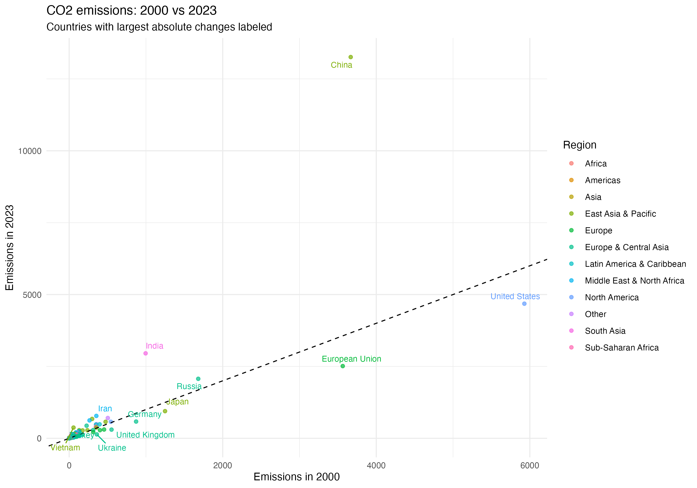
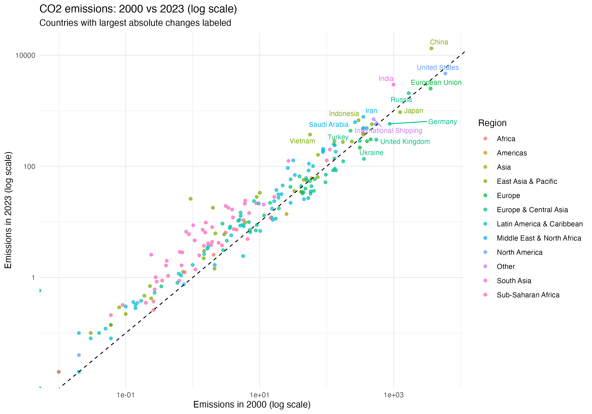
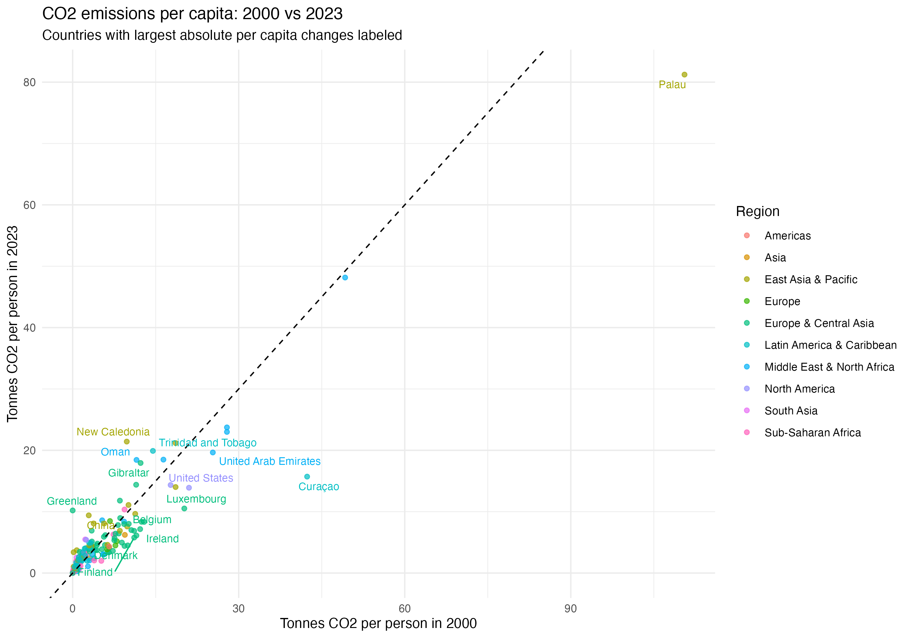
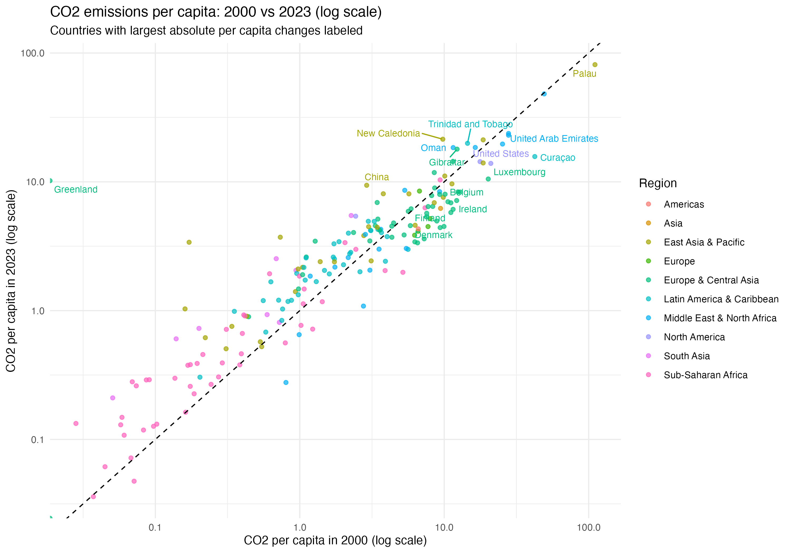

# CO2 Emissions Analysis

This project explores global CO2 emissions using publicly available data from Wikipedia and the World Bank.

The project began as a technical exercise in:
- web scraping
- data cleaning
- joining datasets
- exploratory data analysis (EDA)
- visualisation in R

However, the analysis gradually developed into a broader exploration of how different ways of measuring emissions can lead to very different interpretations of responsibility and climate impact.

---

## Main questions

The project explores questions such as:

- Which countries emit the most CO2 in total?
- Which countries emit the most CO2 per capita?
- How have emissions changed from 2000 to 2023?
- How do regional patterns differ?
- How useful are broad categories such as “West vs Rest”?
- What are the limitations of territorial emissions data?

---

## Data sources

### CO2 emissions
Wikipedia:
https://en.wikipedia.org/wiki/List_of_countries_by_carbon_dioxide_emissions

### Population data
World Bank World Development Indicators (WDI):
https://data.worldbank.org/indicator/SP.POP.TOTL

### Regional classifications
R package:
- countrycode

---

## Project structure

### 01_scrape_co2.R
Scrapes CO2 emissions data from Wikipedia.

### 02-1_clean_co2.R
Cleans and restructures the emissions dataset.

### 02-2_wdi_population.R
Downloads population data from the World Bank and merges it with the emissions dataset.

### 03_analysis_plots.R
Creates exploratory plots and comparative analyses.

---

## Preliminary observations

### Total emissions and per capita emissions tell different stories

Countries with very large populations dominate total emissions, while small countries can appear as extreme outliers in per capita analyses.

### Small states and shipping economies can distort per capita measures

Some countries and territories appear to have unusually high per capita emissions due to:
- shipping registration
- offshore activities
- export-oriented industries
- small populations

This illustrates the importance of critically evaluating what the data actually measures.

### Territorial emissions do not necessarily reflect consumption

Countries with large export sectors may appear highly polluting even when a significant share of production is consumed abroad.

Conversely, countries with relatively low domestic emissions may consume large quantities of imported carbon-intensive goods.

This raises important methodological questions about:
- production-based emissions
- consumption-based emissions
- embedded emissions in international trade

### “West vs Rest” may no longer be analytically useful

An initial “West vs Rest” framing was used as a starting point for exploration.

However, the analysis increasingly suggests that such categories may oversimplify modern global emissions patterns.

Future work will therefore explore:
- income groups
- regional differences
- consumption-based emissions
- emissions relative to GDP

inspired partly by the work of Hans Rosling and Gapminder.

---

## Future directions

Planned extensions include:
- consumption-based emissions
- GDP-adjusted emissions
- income-group analysis
- Gapminder-style bubble charts
- animated visualisations over time

---

## Example figures

### Total emissions: 2000 vs 2023

Countries with the largest absolute changes labelled.

### Total emissions: 2000 vs 2023, log scale

The logarithmic scale makes smaller emitters easier to compare.

---

### Per capita emissions: 2000 vs 2023

Countries with the largest absolute per capita changes labelled.

### Per capita emissions: 2000 vs 2023, log scale

Regional patterns and outliers highlighted using logarithmic scales.

